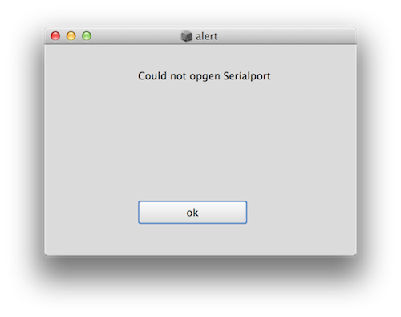
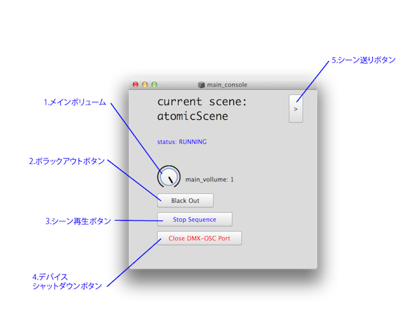

KOROGARU-PAVILION Software
=================


#####YCAM10　コロガルパビリオン　音響／照明システムソフトウエア
#####2013/07/30 森 浩一郎 Uniba Inc.


### 動作環境

- Mac OSX 10.8 以降
- Python 2.7以降
- SuperCollider v3.6以降


### インストール 手順

####1.Git Repository

githubのリポジトリをクローンします。

```
sudo mkdir /dev-app/

cd /dev-app/

git clone git@github.com:moxuse/korogaru-pavilion.git
```


####2.Pythonライブラリ

Pythonライブラリをインストールします。以下のコマンドをターミナルで実行

#####pySerial


```
sudo pip install pySerial
```
#####setproctitle

```
sudo pip install setproctitle
```

#####optparse

```
sudo pip install optparse
```

#####pyOSC

以下pyOSC-0.3.5b-5294.tar.gzからDLしてインストール。

[pyOSC](https://trac.v2.nl/wiki/pyOSC)

#####numpy

```
sudo pip install numpy
```


####3.Sound File


以下に使用するサウンドファイルをコピー。

korogaru-pavilion/app/sounds/


####4.DMX.sc

[DMX.sc](https://github.com/supercollider-quarks/dmx)

をダウンロード

dmx/ フォルダを /korogaru-pavilion/lib/class/ のフォルダにコピー


####5.FTDI USB Serial VCPドライバのインストール


[http://www.ftdichip.com/Drivers/VCP.html](http://www.ftdichip.com/Drivers/VCP.html)

ENTTEC USB Pro をVirtual COM Port(VCP)で認識するためのドライバウエアを上記よりダウンロード


（本番環境ではMac OS X / x64 (64-bit) / v 2.2.18 を使用）


####6.startup.scdのコピー
korogaru-pavilion/startup.scdを

/Users/<YOUR_USER>/Library/Application Support/SuperCollider/

にドラッグアンドドロップでコピーもしくは..


```
cd /dev-app/korogaru-pavilion/

cp startup.scd '/Users/<YOUR_USER>/Library/Application\ Support/SuperCollider/startup.scd' 

```

をターミナルで実行。


### 起動
SuperColliderを起動します。

startup.scdが実行され、メインGUIが表示され、

自動的にシーケンスが始まります。



デバイスの認識がうまく行かない場合や、

複数のシリアルポートのプロセスが存在した場合上記のようなアラートが出ます。

SuperColliderを再起動するか、マシンを起動し直してみてください。

### ソフトウエアアップデート方法
githubのリポジトリーから最新のソースをpullします。

以下のコマンドをターミナルで実行。

```
cd /dev-app/korogaru-pavilion/

git pull origin master
```

サウンドファイルを

korogaru-pavilion/app/sounds/

にコピーして完了。

###メインGUI



ソフトウエア起動中は以上のようなGUIが表示されます。


#####1.メインボリューム

サウンドの全体のボリュームをコントロールします。


#####2.ブラックアウトボタン

照明を暗転します。

#####3.シーン再生ボタン

シーンのシーケンスを中断します。もう一度押すと再開します。


#####4.デバイスシャットダウンボタン


USBデバイスとシリアルポーをの認識をシャットダウンします。


#####5.シーン送りボタン

次のシーンにシーンを送ります。


###シーン制御OSCメッセージ

以下のOSCメッセージでシーン送りをする事ができます。

```
ポート：57120

メッセージ：/next_scene

```


###ライセンス

[MITライセンス](http://opensource.org/licenses/mit-license.php)にて配布。


